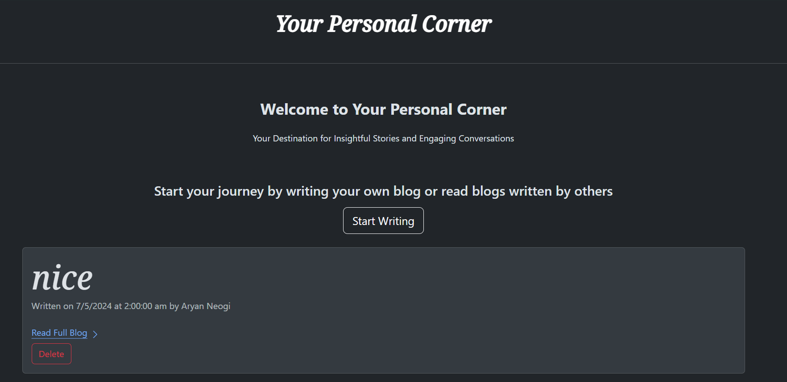

# Your Personal Corner

Your personal corner is a web blog application hosted on your local computer, where not only you can write blogs but also edit and delete them.

All blogs are stored and can be retrieved in another session along with the time of posting and name of author.



## To run the code
**First install all node modules**

```
npm i
```
**Then run the server**

```
node index.js
```
## Features
* You can write stories, views and thoughts along with your name
* The data will be stored in a MongoDB database and can be retrieved in another session
* You can edit and delete your blogs
* You can access all blogs in the home page along with time of posting and name of author
* Markdown is enabled

## Languages and Frameworks used

1. **JavaScript** :- Used to handle server side code
2. **EJS (Embedded JavaScript)** :- Used for writing Javascript code in HTML page
3. **CSS and BootStrap** :- Used for styling and responsiveness
4. **Node.js** :- Used for importing several helpful modules like *marked* for markdown, *slugify* for creating slugs in place of long website id and most importantly *express*
5. **Express.js** :- Used for handling server side application

## Future Ideas

- [ ] Add like and dislike buttons
- [ ] Add a comment section
- [ ] Deploy on a live server